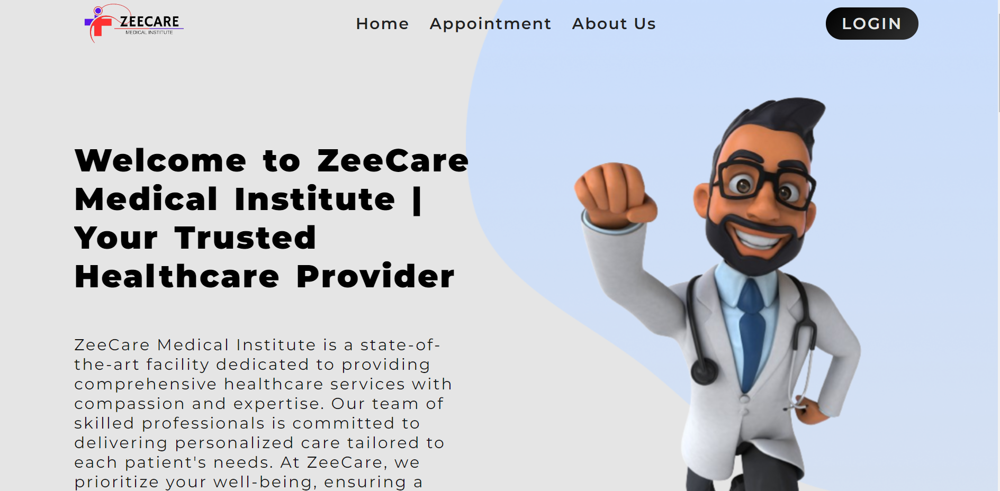
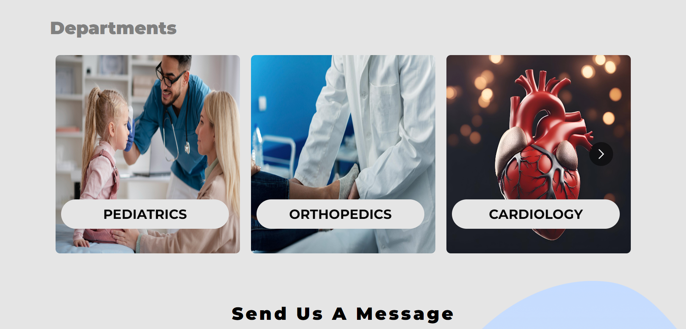

# Hospital_Management_System
A robust MERN-based system for hospitals featuring authentication & authorization, handling multiple JSON Web Tokens, dual frontends for users and admins, and a scalable architecture.

Features
<li>Authentication & Authorization</li> 
<li>Multiple JSON Web Tokens</li>
<li>User and Admin Dashboards</li>
<li>Scalable Architecture</li>

 
 
<h3>Home Page UI</h3>
 

 
 
<h3>Department Section UI</h3>
 
 

                           
